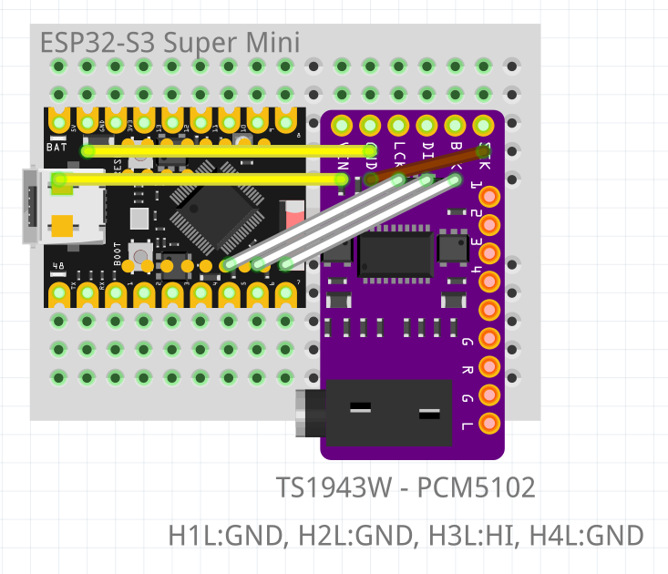
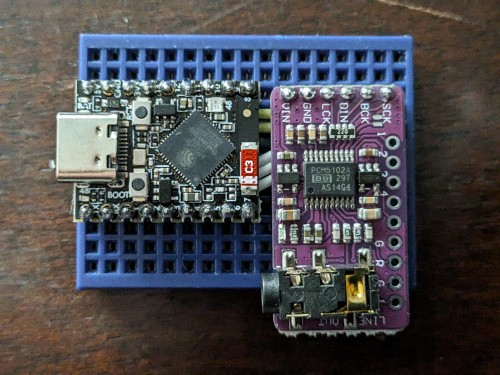
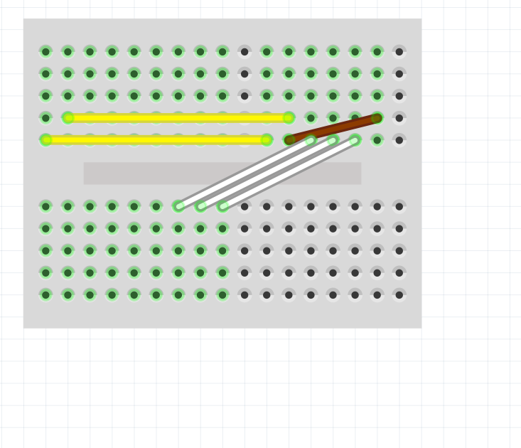
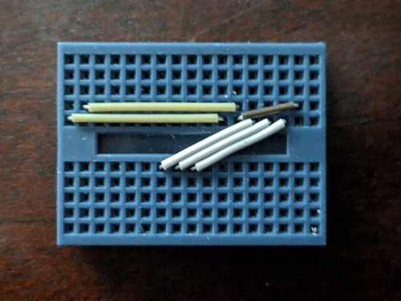
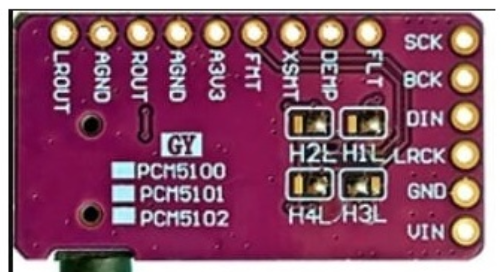

# Simplest Ever Internet Radio 📻

The simplest, cheapest, and easiest way to connect your classic stereo receiver to the internet and stream high-quality audio! Powered by an **ESP32-S3 Super Mini**, a **PCM5102A (TS1943W) DAC**, and **ESPHome**, this project integrates seamlessly into **Home Assistant** as a standard media player.

With only 6 wires, a mini breadboard, and basic soldering (just header pins and 4 configuration pads), you can build a premium network audio streamer in under 30 minutes.

---

## 🛠️ Hardware Requirements

*   **[ESP32-S3 Development Board](https://www.aliexpress.com/item/1005006637349060.html)** (with PSRAM enabled—see list below)
*   **[PCM5102A (TS1943W) DAC Breakout Board](https://www.aliexpress.com/item/1005010329558215.html)**
*   **Mini Breadboard**
*   **6 Jumper Wires**
*   **USB-C Power Cable & Power Brick**
*   **3.5mm to RCA** (or 3.5mm to 3.5mm) audio cable (to connect the DAC to your stereo's `AUX` or `Line In` port)

### 💡 Verified ESP32-S3 Boards (PSRAM Required)

Since this project buffers audio to prevent stuttering, a board with active PSRAM is mandatory. The following boards have been verified to work:

#### 1. ESP32-S3 Super Mini (PSRAM Edition)
*   **Memory:** 4MB Flash + **2MB PSRAM** (ESP32-S3R2 chip)
*   **PSRAM Type:** Embedded Quad SPI (QSPI)
*   **Pros:** Ultra-compact form factor; fits anywhere.
*   **What to look out for:** Ensure the listing explicitly mentions "PSRAM" or "R2", as there is a cheaper, flash-only version of this exact board that will crash with `ESP_ERR_NO_MEM`.

#### 2. Official Espressif ESP32-S3-DevKitC-1-N8R8 or -N16R8
*   **Memory:** 8MB or 16MB Flash + **8MB PSRAM** (ESP32-S3-WROOM-1 module)
*   **PSRAM Type:** External Octal SPI (OPI)
*   **Pros:** Standard flagship development board, uses the fastest Octal PSRAM, maximum stability in ESPHome.
*   **What to look out for:** Make sure the part number contains the **R8** suffix (e.g., `N8R8`). Avoid the `N8` or `N16` models, which have zero PSRAM.

#### 3. Waveshare ESP32-S3-Zero
*   **Memory:** 4MB Flash + **2MB PSRAM** (ESP32-S3R2 chip)
*   **PSRAM Type:** Embedded Quad SPI (QSPI)
*   **Pros:** Extremely tiny, castellated holes for direct soldering, uses a single USB-C port with an onboard CH343 serial bridge chip for hassle-free flashing.
*   **What to look out for:** Like the Super Mini, double-check that the vendor specifies the PSRAM variant.

#### 4. Seeed Studio XIAO ESP32S3
*   **Memory:** 8MB Flash + **8MB PSRAM**
*   **PSRAM Type:** External Octal SPI (OPI)
*   **Pros:** High-quality, tiny thumbnail form factor, equipped with 8MB of fast Octal PSRAM. Very popular for compact audio and camera projects.
*   **What to look out for:** Do not accidentally buy the standard *XIAO ESP32C3* or *XIAO ESP32S3 Sense* (unless you specifically want the detachable camera addon card that comes with the Sense kit).

#### 🛒 Quick Buying Checklist Rule of Thumb:
When clicking "Add to Cart" on marketplaces like AliExpress or Amazon, look for the variant dropdown menus. **Always select the option labeled `OPI` or `With PSRAM`.** If an option is labeled `qSPI / No PSRAM` or just lists a single number like `16MB`, skip it.

---

## 📐 Wiring Diagrams & Setup

You can find both the Fritzing schematic diagrams and actual reference photographs of the breadboard assembly below. 

The original Fritzing project file is available here: [Simplest Internet Radio HomeAssistant.fzz](Simplest%20Internet%20Radio%20HomeAssistant.fzz)

### 1. Complete Schematic & Build (All Parts)
Here is the Fritzing diagram and the corresponding completed hardware assembly. The boards sit directly over the flat jumper wire routing:

| Fritzing Schematic (All Parts) | Physical Completed Build |
| :---: | :---: |
|  |  |

### 2. Wire Connections Only (Underneath the Boards)
Since the modules cover the jumper wires, here is the diagram and reference photo showing the flat wire routing on the mini breadboard before plugging in the boards:

| Fritzing Wire Connections | Physical Wire Routing |
| :---: | :---: |
|  |  |

---

## 🔌 Step-by-Step Assembly Guide

### Step 1: Hard-Solder the Configuration Bridges

On the back of the PCM5102A breakout board, there are four sets of three-pad jumpers labeled H1L through H4L. Use a soldering iron and a small dab of solder to bridge the **Center** pad to either the **L** (Low) or **H** (High) pad as follows:



| Jumper | Label | Connection | Setting Details |
| :--- | :--- | :--- | :--- |
| **H1L** | FLT | **Center** ➔ **L** | Normal Latency filter |
| **H2L** | DEMP | **Center** ➔ **L** | De-emphasis Off |
| **H3L** | XSMT | **Center** ➔ **H** | **Unmuted** (Crucial—otherwise no sound!) |
| **H4L** | FMT | **Center** ➔ **L** | I2S Format |

---

### Step 2: Wire the Hardware

Pop the ESP32-S3 Super Mini and the PCM5102A onto your mini breadboard, and connect them using your jumper wires:

| ESP32-S3 Super Mini Pin | PCM5102A DAC Pin | Function / Description |
| :--- | :--- | :--- |
| **VIN** (or VBUS) | **5V** (or VCC) | Main power supply |
| **GND** | **GND** | System ground |
| *N/A* (Ground loop) | **SCK** ➔ **GND** | Forces the DAC to generate its own internal clock |
| **GPIO5** | **LCK** (LRCK) | Left/Right Clock (I2S) |
| **GPIO6** | **DIN** | Data In (I2S) |
| **GPIO7** | **BCK** | Bit Clock (I2S) |

*Finally, connect the DAC's 3.5mm audio jack to your stereo's `AUX` or `Line In` port using your audio cable.*

---

## 💻 Software Deployment

### 1. Copy the ESPHome Configuration
Use the configuration in [Simplest Internet Radio HomeAssistant.yaml](Simplest%20Internet%20Radio%20HomeAssistant.yaml). Ensure your Wi-Fi details, API keys, and OTA passwords are configured in your ESPHome `secrets.yaml` file.

### 2. Clean Build (Mandatory)
Before compiling, you must perform a clean build to ensure low-level PSRAM changes are applied:
1. Open your ESPHome Dashboard.
2. Click the three dots on the device card (`esp32-stereo-link`).
3. Select **Clean Build**.

### 3. Compile and Download
Compile the configuration and download the **factory binary file** (`esp32-stereo-link-firmware.factory.bin`) to your local computer.

### 4. Flash the Board
Connect the ESP32-S3 Super Mini to your computer via USB. Run the following command in your terminal to flash the board, bypassing the missing system stub layout file:

```bash
sudo esptool --chip esp32s3 --no-stub --port /dev/ttyACM0 write_flash -z 0x0 ~/Downloads/esp32-stereo-link-firmware.factory.bin
```
*(Adjust `/dev/ttyACM0` and the file path according to your OS and download location).*

---

## 🎵 Streaming Audio via Home Assistant

### 1. Discovery
Once the board flashes, boots up, and connects to your Wi-Fi network, Home Assistant will automatically discover it. A new `media_player.stereo_internet_radio` entity will appear under the ESPHome integration.

### 2. Initialize Volume
> [!IMPORTANT]
> If the device connects but stays silent during playback, open the ESP32's local IP address in a web browser. Slide the volume up from **0%** to **80%** to initialize the internal volume state.

### 3. Stream a Station
You can play streams by calling the `media_player.play_media` service. For example, to play Radio Paradise:

```yaml
service: media_player.play_media
target:
  entity_id: media_player.stereo_internet_radio
data:
  media_content_id: "http://stream.radioparadise.com/mp3-192"
  media_content_type: "music"
```

Enjoy your high-fidelity, ultra-simple internet radio! 📻🎶
